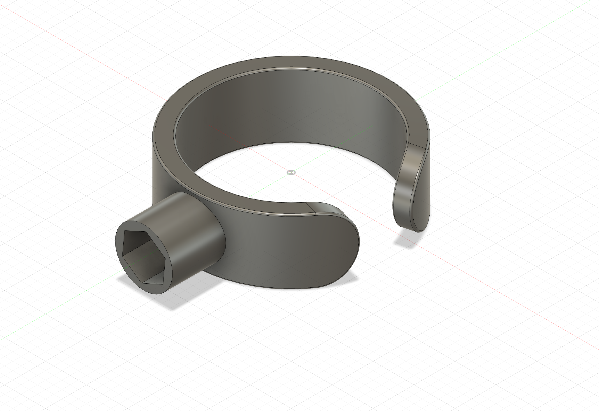

# Knurlie Cable Clip

There are cable management clips for eurorack systems that are based on being screwed in place with the standard M3 screws; however, if you use Knurlies these are
bigger and get in the way. These are prototypes designed to ride on top of the Knurlie.

## History

