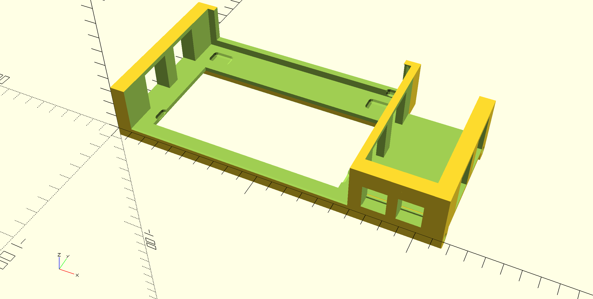

# Modular 1U Unifi USW-8-60W

I needed a 1U rack for some raspberry pis and a unifi USW-8-60W POE switch so I made this to take the plance of 3 Pis in the [modular 1U rack](https://www.printables.com/model/150105-raspberry-pi-1u-rack-mount-and-oled-tray-remix).

Includes a friction fit place for the USW as well as two places for keystone jacks.

From:
* https://www.printables.com/model/150105-raspberry-pi-1u-rack-mount-and-oled-tray-remix
* https://www.thingiverse.com/thing:4125055/files

